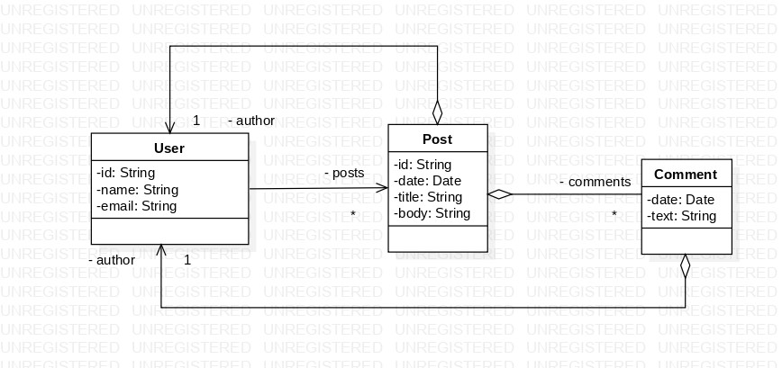

<h1> Documentação do projeto </h1>

 

  

      API Restful que simula uma rede social semelhante ao Twitter, utilizando a estrutura da rede social atual como base. Através da API, os usuários poderão realizar postagens, 
      comentários e interações entre si. Para facilitar o armazenamento e gerenciamento de dados, será utilizado um banco de dados orientado a documentos (MongoDB) em conjunto com 
      o framework Spring Boot. Serão utilizadas associações entre objetos aninhados e referências de consulta simples por meio do Spring Data e MongoRepository. Essa abordagem permitirá 
      um armazenamento eficiente e um acesso ágil aos dados relacionados às postagens e comentários dos usuários.
       
      

      Uma vantagem adicional do uso do banco de dados orientado a documentos MongoDB é a capacidade de escalabilidade da aplicação, tanto para as postagens quanto para os comentários, 
      que serão armazenados de forma aninhada no banco de dados. Isso garante uma estrutura flexível e adaptável para a expansão da rede social.
      

  

<h2> Tecnologias usadas: </h2>
   <h3>Back-End</h3>
    <h4> 
      

       
       Java
       
       Spring Boot
       
       MongoDB Database
       

   </h4>

    <h3> Destrinchando a estrutura UML: </h3>

 

🔹 `User`: Classe que representa o usuário com seus dados armazenados. Um usuário pode ter várias postagens, representadas por `- posts`, e pode fazer comentários em postagens, representados por `- comments`. 
- `*`: Expressão utilizada para indicar que um usuário pode ter vários `posts`. 

🔹 `Post`: Classe que representa uma postagem do usuário. Toda postagem deve ter um autor, indicado por `- author`.  Além disso, existe uma dependência da classe `Comment` com a classe `Post`, pois uma postagem pode ter vários comentários, representados por `- comments`.
- `1`: Expressão utilizada para demonstrar uma associação entre as classes, indicando que um `User` deve ter exatamente um `- author`.

🔹 `Comment`: Classe que representa o(s) comentários(s) de uma postagem. 
- `*`: A dependência com a classe `Post`, ou seja, um `Post` pode ter vários `- comments`.
- `1`: Determina a mesma regra da classe `Post`, onde um comentário **deve** ter um `- author`.

> Dessa forma, mantém-se a dependência com a classe `User`, pode ser `- author`, dos `- posts` e/ou `- comments`.
